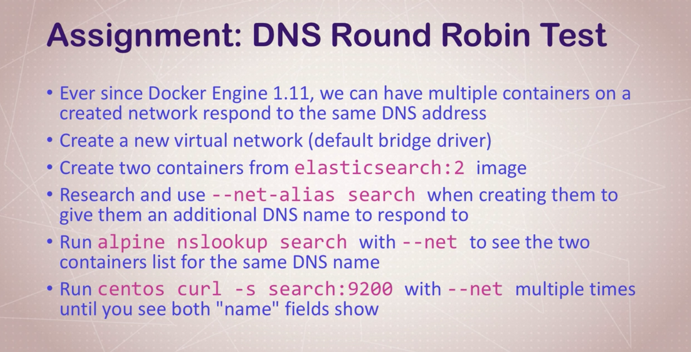

> Notes from Docker-Mastery udemy course.

# Creating and using Containers 

### Running containers 

```bash
$ docker container ls -la ## list all the containers 
$ docker container -d -p 80:80 --name proxy nginx 
$ docker container -d -p 8080:80 --name webserver httpd 
$ docker container -d -p 3306:3306 --name db --env MYSQL_RANDOM_ROOT_PASSWORD=yes mysql 
$ docker container stop ## stop the container 
$ docker container rm ## remove the container from memory 
$ docker info 
$ docker --version
```

### What is going inside a container from outside? 
```bash
$ docker container top nginx ## process list in one container 
$ docker container inspect nginx ## details of one container config
$ docker container stats ## performance stats of all the running containers 
```

### What is going inside a container from inside? 
```bash 
$ docker container run -it containerName bash ## start a new container interactively
$ docker container exec -it containerName CMD ## run additional command in existing running container
$ docker container start -ai containerName  CMD ## start existing stopped container
$ exit 
$ docker pull alpine 
$ docker image 
```

### Docker Networks: Concept of Private and Public Comms

* Each container connected to a private virtual network ```bridge```
* Each virtual network routes through NAT firewall on host IP
* All containers on a virtual network can talk to each other without ```-p```
* Best practice is to create a new virtual network for each app: 
    * network ```my_web_app``` for mysql and php/apache containers 
    * network ```my_api``` for mongo and nodejs containers
* Batteries Included, But Removable 
    * Defaults work well in many cases, but easy to swap out parts to coustomize it
* Make new virtual networks 
* Attach containers to more than one virtual networ (or none)
* Skip virtual networks and use host IP (--net host)
* Use different Docker network drivers to gain new abilities.
* Much more.......
```bash 
$ docker container run -p 80:80 --name webhost -d nginx
$ docker container port webhost
## We do not know the ip of the container
$ docker container inspect --format '{{.NetworkSettings.IPAddress}}' webhost
$ ifconfig en0
```

* Container and the host are not on the same network.
* ```$ docker container run -d --name proxy --publish hostPort:containerPort nginx```

### Docker Networks: CLI Management

* Show networks ```docker network ls```
* Inspect network ```docker network inspect```
* Create a network ```docker network create --driver```
* Attach a network to container ```docker network connect```
* Detach a network from container ```docker network container```

```bash
$ docker network ls 
$ docker network inspect bridge ## shows container attached to a specific network in this case bridge
$ docker network create my_app_net
$ docker network ls 
$ docker container run -d --name new_nginx --network my_app_net nginx
$ docker network inspect my_app_net
##  We do not want to start new contianers, ideally we want to connect existing containers to different virtual networks
$ docker network connect
$ docker network disconnect
```

### Docker Networks: DNS

* Understand how DNS is the key to easy inter-container comms 
* See how it works by default with coustom network
* Learn how to use ```--link``` to enable DNS on default bridge network

Naming is the key in dynamic containers addresses. Docker daemon (```Docker DNS```) has a built-in DNS server that containers use by default

* Containers should not really rely on ip addresses  for communication
* DNS for friendly names is built-in if we use custom network
* Your using coustom network right.

DNS Assignment 



Solution 

```bash
$ docker network create dude 
$ docker container run -d --net dude --net-alias search elasticsearch:2
$ docker container run -d --net dude --net-alias search elasticsearch:2
$ docker container run --rm --net dude alpine nslookup search 
$ docker container run --rm --net dude centos curl -s search:9200
```


# Container Images: where to find them how to build them
### What's in An Image ? (And What isin't)
* App binaries and dependencies 
* Metadata about the image data and how to run the image 
* Official definition: "An image is an ordered collection of root filesystem changes and the corresponding execution parameters for use within a container runtime."
* Not a complete OS. no kernel, kenrnel modules (eg. drivers). Host provides kernel. 
* Small as on file (your binary app) like golang static binary
* Big as a Ubuntu distro with apt, and Apache, PHP, and more installed


> [Dockerfile Reference](https://docs.docker.com/engine/reference/builder/#dockerignore-file)

### Image Layers, Image Cache
* Image Layers 
* Union Filesystem: present a series of filesystem changes as an actual filesystem 
* ```history``` and ```inspect``` commands 
* copy on write: container runs as an additional layer on top of an image 

```bash
$ docker history elasticsearch:2
$ docker history containerName:tagName 
```

* Properly tagging images 
* Tagging images for upload to Docker Hub 
* How tagging is related to imageID 
* The latest Tag.
* Logging into Docker Hub from docker cli
* How to create private docker image

### Building Images: Dockerfile Basics
```bash
FROM node:6.13.0-alpine

EXPOSE 3000 

RUN apk add --update tini \
    && mkdir -p /usr/src/app 

WORKDIR /usr/src/app

COPY ./package.json /usr/src/app/package.json 

RUN npm install \
    && npm cache clean --force

COPY . /usr/src/app

CMD tini -- node ./bin/www
```

```bash
## docker commands to build coustom docker image 
$ docker image build -t coustomnginx .
$ docker image build -t nginx-with-html .
## building the above docker file and putting on dockerhub
$ docker image build -t visingh/nodeapp .
$ docker container run --rm -p 80:3000 --name testapp visingh/nodeapp 
$ docker push visingh/nodeapp 
$ docker image rm visingh/nodeapp 
$ docker container run -it --rm -p 80:3000 visingh/nodeapp 
```


# Container Lifetime & Persistent Data: Volumes, Volumes and Volumes 

* Containers are usually immutable and ephemeral 
* *"immutable infrastructure"*: only re-deploy containers, never change 
* This is ideal situation, but what about our databases or unique data ? 
* Docker gives us features to ensure these *"seperation of concerns"*
* This is known as *persistent data*
* Two ways: Volumes and Bind Mounts 
* Volumes: make special location outside of container ufs 
* Bind Mounts: link container path to path


# Making it easier with docker compose: The multi container tool 
# Swarm intro and Creating a 3-Node Swarm Cluster 
# Swarm basic features and how to use them in workflow 
# Swarm App Lifecycle 
# Container Registries: image Storage and Distribution
